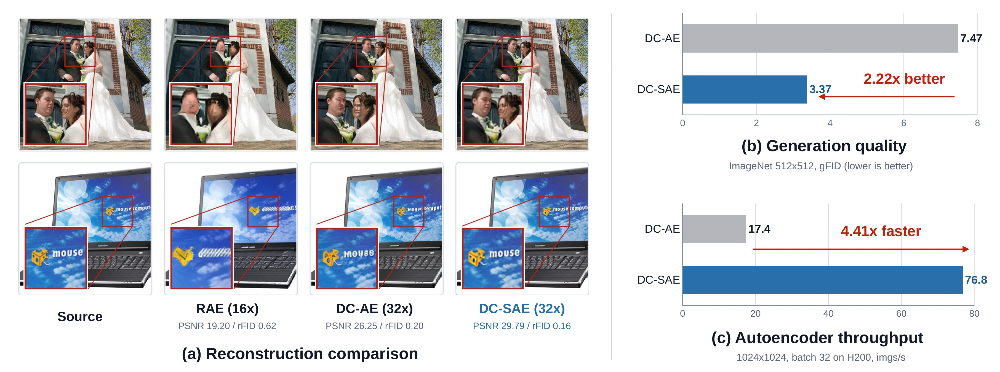
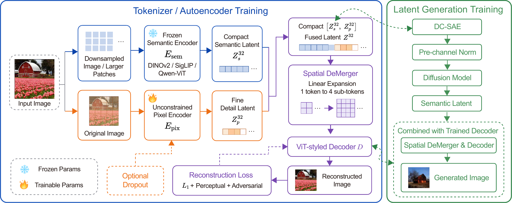

<div align="center">

# [NIPS2026🔥] DC-SAE: Deep Compression Semantic Autoencoder for Faster Diffusion Convergence

Xu Huang<sup>1*</sup> · Ye Huang<sup>1*</sup> · Zijun Liao<sup>1*</sup> · Yuwei Niu<sup>1</sup> · Xiaojie Li<br>
Menghan Zhou<sup>2</sup> · De Wen Soh<sup>2</sup> · Xiaotong Li<sup>1</sup> · Daquan Zhou<sup>1†</sup>

<sup>1</sup> Peking University &nbsp; <sup>2</sup> Singapore University of Technology and Design

<sup>*</sup> 共同第一作者 &nbsp; <sup>†</sup> 通讯作者

[](docs/installation-and-usage-zn.md#installation)
[](docs/installation-and-usage-zn.md)
[](https://huggingface.co/DAGroup-PKU/DCSAE)
[](LICENSE)

[English](README.md) · **简体中文** · [安装与使用](docs/installation-and-usage-zn.md)

</div>



## 🎬 Demo

https://github.com/user-attachments/assets/b29a4cd4-d103-4f7c-a890-2cdde307ef36

**[▶ 观看演示视频](https://github.com/user-attachments/assets/b29a4cd4-d103-4f7c-a890-2cdde307ef36)** · [MP4](https://github.com/DAGroup-PKU/DCSAE/raw/refs/heads/main/assets/demo.mp4) · [英文字幕](assets/demo.vtt)

## 项目简介

**dc-sae** 提供从图像重建到 latent 空间生成的完整训练与评估流程。预训练视觉编码器提取语义特征，HF 分支补充高频信息，decoder 将 latent 重建为图像；DiT 则学习对应的 latent 分布，实现类别条件生成。

代码包括 SAE 与 DiT 训练、latent 统计量计算、重建 **PSNR / rFID** 和生成 **gFID** 评估，并提供 **256px / 512px** 的评估说明。不同模型需使用与 checkpoint 匹配的配置。

| 组件 | 功能 |
| :--- | :--- |
| **Semantic + HF 编码** | 结合预训练视觉特征与补充高频信息的 HF 分支。 |
| **重建解码器** | 将 latent 解码为图像，支持可选的空间 demerger。 |
| **Latent DiT** | 使用配套的 latent 归一化统计量，训练与采样类别条件生成模型。 |
| **评估流程** | 使用明确的参考文件和采样设置，计算重建 PSNR/rFID 及生成 FID。 |



## Installation & Usage

```bash
git clone -b main --single-branch https://github.com/DAGroup-PKU/DCSAE.git
cd DCSAE
```

依赖安装、模型下载、权重放置和完整运行命令，请查看 **[安装与使用指南](docs/installation-and-usage-zn.md)**。所有命令均在仓库根目录执行。

| 开始使用 | 对应说明 |
| :--- | :--- |
| 安装依赖 | [环境配置](docs/installation-and-usage-zn.md#installation) |
| 下载 DINOv2、准备 checkpoint | [数据与预训练模型](docs/installation-and-usage-zn.md#assets) |
| 训练自编码器 | [SAE 训练](docs/installation-and-usage-zn.md#train-sae) |
| 评估重建质量 | [PSNR 与 rFID](docs/installation-and-usage-zn.md#reconstruction) |
| 准备 latent、训练 DiT | [Latent 统计量](docs/installation-and-usage-zn.md#latent-stats) · [DiT 训练](docs/installation-and-usage-zn.md#train-dit) |
| 评估生成质量 | [256px / 512px gFID](docs/installation-and-usage-zn.md#gfid) |

> 预训练 backbone、SAE/DiT 权重、数据集与 FID 参考文件需单独下载或自行提供。指南包含官方 ImageNet 参考文件链接，并说明 checkpoint、配置与 latent 统计量的匹配关系。

## 目录结构

```text
dc-sae/       SAE / DiT 训练、评估、模型模块与示例配置
models/       DiT / DDT 模型及公共工具
data/         ImageNet WebDataset 支持
train_vae/    SAE 训练所需的 GAN 组件
docs/         中英文安装与使用指南
tests/        离线 CPU 检查
```

训练直接使用标准 **torchrun**，支持单机或多节点运行。随附的 DINOv2 + HF64 配置是端到端架构示例；其他 checkpoint 需使用各自配套的配置。

## 许可证与致谢

源码采用 [MIT 许可证](LICENSE)。保留的第三方依赖及其许可证见 [第三方声明](THIRD_PARTY_NOTICES.md)。预训练模型与数据集各自适用其使用条款。

代码检查及其验证范围记录于 [VALIDATION.md](VALIDATION.md)。

我们的工作基于 [RAE 代码仓库](https://github.com/bytetriper/RAE)。感谢作者们的出色工作，以及对代码的开源分享。
